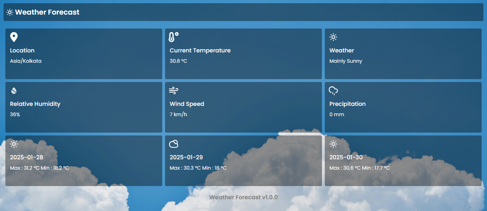

# Weather Forecast

## API Reference

This project uses the [Open Meteo](https://open-meteo.com/en/docs#current=temperature_2m&hourly=&daily=weathercode,temperature_2m_max,temperature_2m_min,sunrise,sunset&timezone=auto&past_days=3) API.

